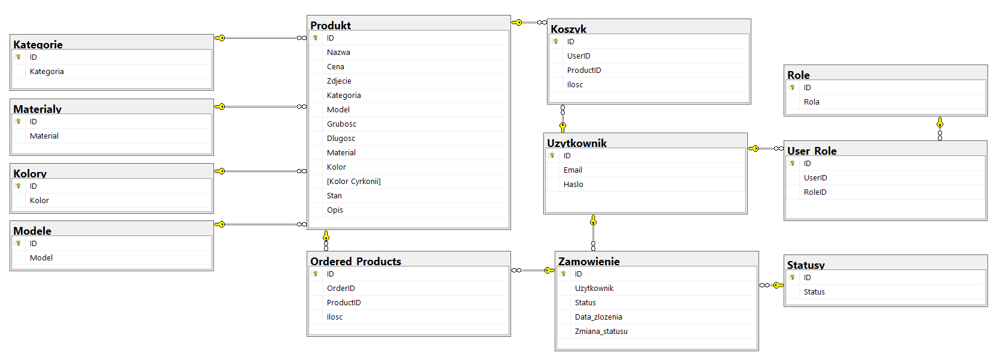

# JS-online-shop

This project is an Online Shop Web Application built using Node.js, Express.js, and EJS templating engine. It provides users with a platform to browse, search, and purchase products online. The application supports features such as user authentication, product management, shopping cart functionality and order processing.

## Key Features
1. **User Authentication:** Users can create accounts and log in securely.
2. **Product Management:** Admin users have the ability to add, edit, and delete products.
3. **Shopping Cart:** Users can add products to their cart, update quantities, and proceed to checkout.
4. **Order Processing:** Users can view their order history, and admin users can manage order statuses.

## Technologies Used
- **Node.js** 
- **Express.js** 
- **EJS (Embedded JavaScript)** 
- **HTML/CSS**
- **JavaScript**
- **Microsoft SQL Server (MSSQL)**

Database management is handled through repositories, where operations on data are performed. Meanwhile, in the main part of the application, the database is accessed through functions provided by these repositories.

TODO:
- niezalogowany użytkownik "do koszyka" (main 404)
- wyświetlanie statusu w zamówieniach użytkownika (foreach w main 117)
- odpowiednia klikalność zamówień (admin i użytkownik)
- Sensowna konwersja czasu (kazachstan zachodni)
- rozmiar wyświetlanych zdjęć ujednolicony
- rozdział maina na pliki sterujące
- "wyloguj"
- "dodaj kategorię/kolor/..."
- zmniejszenie ilości sztuk na stanie po złożeniu zamówienia
- przy niezalogowaniu i kliknieciu admina przechodzenie do logowania